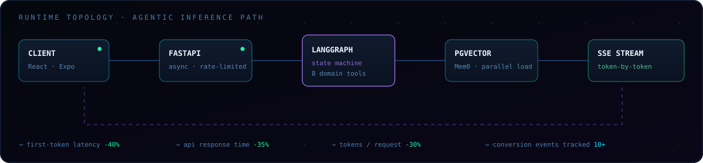

<div align="center">



<br/>

<a href="https://thetan.in"></a>
<a href="https://www.linkedin.com/in/tanishq-bhosale/"></a>
<a href="mailto:bhosaletanishq4@gmail.com"></a>


<br/><br/>


</div>

---

## `01 //` RUNTIME

<div align="center">

</div>

> I build the layer users never see but always feel — the part that decides whether an AI product responds in 300ms or 3 seconds.
> Two years of that: async microservices, agentic graphs, vector memory, and query plans that stopped embarrassing themselves after I got to them.

```ts
const tanishq = {
  role:      "Software Development Engineer I",
  at:        "Tap Academy · Bangalore",
  focus:     ["agentic AI systems", "async backends", "streaming APIs"],
  stack:     { core: "FastAPI + PostgreSQL + AWS", edge: "React · React Native" },
  shipped:   ["AI Fitness Coach", "MindSnack Quiz Engine", "AI Résumé Builder"],
  obsession: "cutting first-token latency until it stops being noticeable",
  status:    "open to hard backend + AI problems",
} as const;
```

---

## `02 //` STACK

<div align="center">

**Core**


**Data & Infra**


**Interface**


<br/>


</div>

---

## `03 //` BUILD LOG

<details>
<summary><b>&#9656; AI Fitness Coach</b> &nbsp;<code>LangGraph</code> <code>FastAPI</code> <code>pgvector</code> <code>React Native</code> &nbsp;— <i>agentic coaching engine, 2025</i></summary>

<br/>

- Architected an agentic backend on **LangGraph + FastAPI** with **8 domain-specific tools** wired into a single state graph.
- Parallelised context loading across **Mem0** and **pgvector**, cutting **first-token latency by 40%**.
- Shipped **SSE streaming** with server-side rate limiting so the mobile client renders tokens as they generate.


</details>

<details>
<summary><b>&#9656; AI Résumé Builder</b> &nbsp;<code>FastAPI</code> <code>LaTeX</code> <code>Neon</code> <code>Docker</code> &nbsp;— <i>self-correcting generation loop, 2026</i></summary>

<br/>

- Full-stack résumé-tailoring app that scores résumé↔JD fit and emits one-page PDFs through a **generate → compile → verify** LaTeX loop that repairs its own failures.
- LLM pipeline with **model routing, retries and fallbacks**, plus an **AI fact-judge guardrail** that blocks fabricated experience before it reaches the page.
- JWT auth, multi-tenant data on **Neon Postgres**, and per-request **cost / latency / token analytics**.
- Shipped on Docker → Render + Vercel with environment-scoped config.


</details>

<details>
<summary><b>&#9656; MindSnack Quiz Builder</b> &nbsp;<code>TypeScript</code> <code>Express</code> <code>Prisma</code> <code>PostgreSQL</code> &nbsp;— <i>no-code quiz engine, 2025</i></summary>

<br/>

- **JSON-driven workflow engine** letting non-engineers configure quizzes and A/B tests without a deploy.
- Express + Prisma APIs with JWT auth, analytics tracking, and payment lead management.
- Analytics pipeline capturing **10+ conversion events per user** for funnel analysis and retargeting.

</details>

<details>
<summary><b>&#9656; AI Code Editor</b> &nbsp;<code>FastAPI</code> <code>LLM APIs</code> <code>React</code> &nbsp;— <i>contextual completions, 2024</i></summary>

<br/>

- Low-latency services for AI code suggestions, debugging and contextual completion.
- Prompt-processing and caching rework dropped **token usage per request by 30%**.

</details>

<details>
<summary><b>&#9656; Earlier experiments</b> &nbsp;<i>vision, ML, and the fun ones</i></summary>

<br/>

| Project | Tech | What it does |
|---|---|---|
| **Clothing Try-On** | DensePose · OpenCV | Real-time pose-mapped garment overlay on user images |
| **Lifestyle Disease Prediction** | scikit-learn · Pandas | Risk model over health features, end-to-end preprocessing → eval |
| **AI Poetry Generator** | NLP · React | Turns regional AQI data into context-aware poetry |
| **Ethereum Price Forecast** | Python · ML | Historical market data → forecasting pipeline |
| **SkillGate Platform** | React · FastAPI · Firebase | Enrollment flows with dynamic routing and lazy-loaded frontend |

</details>

---

## `04 //` TELEMETRY

<div align="center">


<br/>


<br/><br/>


<br/>


<br/><br/>


</div>

---

## `05 //` UPLINK

<div align="center">

I read every message. Fastest route is email; loudest route is LinkedIn.

<a href="mailto:bhosaletanishq4@gmail.com"></a>
<a href="https://www.linkedin.com/in/tanishq-bhosale/"></a>
<a href="https://github.com/tanishqwork"></a>
<a href="https://thetan.in"></a>

<br/><br/>


<sub><code>B.Tech CSE (Data Science) · Presidency University · Bangalore</code></sub>

</div>
